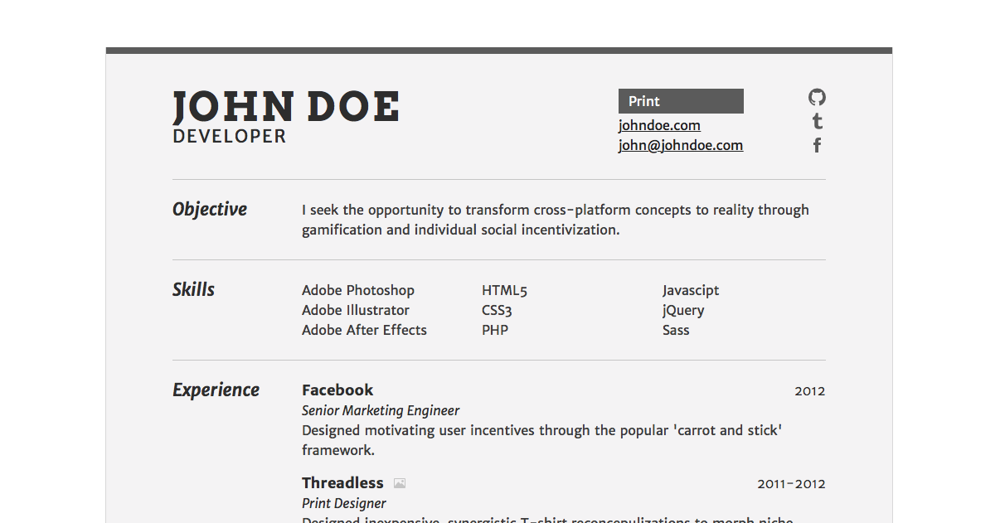

NeueResume
==========



A simple PHP rèsumè template. Create a resume that lives on the web, but prints like it was born in a word processor.
View a live demo [here](http://resume.nickwalker.us/).

Features
* Easy to update XML format
* Include links and images for your jobs or projects section
* Include links to social media (Github, Twitter, etc.)
* Awesome default theme designed to print perfectly
* Fully themable...
* Or just tweakable with simple custom CSS

Installation
------

Just unzip the download into any directory on a PHP 5.2 or above enabled server and you'll be up and running. See the sections below for guidance about writing your resume content and how to customize the installation.

Usage
------
####Adding Resume Content

Take a look at the included example `resume.xml` file. You'll discover that it's 100% human-readable and fairly self explanatory. The `bio` tag and its nodes are exactly what they sound like, but the section nodes that follow merit some explanation.

*Important Note:* Be sure to escape any HTML entities that you may include in a tag. You'll get strange errors otherwise. `<`, `>`, `&`, for instance, would become `&lt;`  `&gt;` `&amp;`. [Here's](http://rishida.net/tools/conversion/) a great tool for converting to XML safe entities.

####Section Types

A `section` node has a title and a type attribute. The title can be whatever you like, but there are only a handful of types. They vary by the amount of detail and emphasis you'd like to place on a given section. For instance, a `list` section is great for bulleted lists of skills, whereas a `highlight` list section is more well suited for a list of prior work experience (for which you might want to include things like an explanation, a date or even images and links).

#####List

The simplest section type. It has `item` child nodes. The `item` nodes have no childen and their content becomes the bulleted text.

````xml
<section title="skills" type="list">
	<item>Adobe Photoshop</item>
	<item>Adobe Illustrator </item>
	<item>Adobe After Effects</item>
	<item>HTML5</item>
</section>
````
#####Detail List

A /little/ more information than a regular old list. Has `item` child nodes. `item` child nodes may have `title`, subtitle`, `date`, `link` and `text` children. This works well for a list of awards where you really just want to show off an award name and a date of reciept. By default, the `text` node will become the rollover text for the entry. If something needs a sentence of explanation or an image, you'll want to use a highlight list instead.

````xml
<section title="awards" type="detail-list">
	<item>
		<title>Outstanding Synergizer</title>
		<link>http://synergy.dev</link>
		<subtitle>Board for the Greater Synergy</subtitle>
		<date>2015</date>
		<text>Hard to get.</text
	</item>
	<item>
		<title>Achievement in Double Speak</title>
		<subtitle>Commission for California Culture</subtitle>
		<date>2011</date>
	</item>
</section>
````

#####Grouped List

Has `group` child nodes. Group nodes have `item` children that are formatted just like the children of a detail list section.

````xml
<section title="awards" type="detail-list">
	<group title="work related">
		<item>
			<title>Outstanding Synergizer</title>
			<link>http://synergy.dev</link>
			<subtitle>Board for the Greater Synergy</subtitle>
			<date>2015</date>
			<text>Hard to get.</text
		</item>
	</group>
	<group title="School">
		<item>
			<title>Achievement in Double Speak</title>
			<subtitle>Commission for California Culture</subtitle>
			<date>2011</date>
		</item>	
	</group>
</section>
````

#####Highlight List

Has `item` child nodes. Highlight list `item` nodes have all of the types of child nodes as the detail list with the addition of an `image` node, which takes the path (relative from the installation folder or absolute if you like).

````xml
<section title="objective" type="text">
	<item>
		<title>Facebook</title>
		<image>http://facebook.com/marketing-team.jpg</image>
		<subtitle>Senior Marketing Engineer</subtitle>
		<date>2012</date>
		<text>Designed motivating user incentives through the popular 'carrot and stick' framework.
		</text>
	</item>
	<item>
		<title>Threadless</title>
		<image>images/shirt.png</image>
		<subtitle>Print Designer</subtitle>
		<date>2011-2012</date>
		<text>Designed inexpensive, synergistic T-shirt reconcepulizations to morph niche markets into main street main stays. </text>
	</item>
</section>
````

Additionally, a special feature of the highlight list is the ability to add arbitrary item elements. If you want to include a small snippet of HTML, an anchor element to make a link maybe, you can do so by specifiying an item with a type of `arbitrary` and wrapping its contents with `CDATA` tags. This will escape any special characters, so feel free to include whatever you like. Note that the tags contents will be dumped verbatim into the list at the appropiate position with no processing.

````xml
<item type="arbitrary">
	<![CDATA[ 
		<article class="see-more"><a href="http://nickwalker.us/">See a gallery of work examples...</a></article>
	]]>
</item>
````

#####Text

Good for a mission statement or an objective. No child nodes.

````xml
<section title="objective" type="text">
	I seek the opportunity to transform cross-platform concepts to reality through gamification and individual social incentivization.
</section>
````

Settings
------

Within the `neueresume` directory, you'll find `settings.php`. Here you can configure a handful
of settings, which are listed below. Any setting can be set in either the root `settings.php` or a settings file at the
root of a theme (though some are more useful in one place than the other). All of these functions 
are part of the NeueResume class under the settings object and can be accessed in theme files with 
`$this->settings` as a prefix.

Theming
------

####"I just want to tweak some things"

Easy! Add a `custom-style.css` file to the same folder where your `resume.xml` lives and your styles will be loaded automatically.

####"I want to write an entirely custom theme"

The default theme is an example of how flexible NeueResume is. That being said, the aim of project is to be as light weight as possible, and this means forgoing any dependencies, including a templating engine. The built in parsing and templating are not as robust as many PHP frameworks that are dedicated to that purpose, but they are /decent/.

#####Getting Started

Create a folder in the themes directory. Name it as you please and then set `$this->settings['general']['theme']` in the root `settings.php` file to the name of your theme. Create a `settings.php` and a `template.php` file in your theme's directory and you're in business.

#####Changing List Formatting

You can overide the HTML structure that NeueResume puts XML elements into setting the following variables in your theme's `settings.php` file:

````php
$this->settings['theme']['listItemFormat']
$this->settings['theme']['detailListItemFormat']
$this->settings['theme']['groupedListGroupFormat']
$this->settings['theme']['highlightListItemFormat']
````
The default string for the `highlightListItemFormat` (which can be found in the root `settings.php` file) looks like this:

````html
<article>
	<hgroup>
		<h2>{{Title}}</h2><a class="icon-link"href="{{Link}}"><a class="icon-picture" href="{{ImagePath}}"></a>
		<h3>{{SubTitle}}</h3>
		<h4>{{Date}}</h4>
	</hgroup>
	<p>{{Text}}</p>
</article>

````
Double braced words are replaced by the content of their corresponding node for the `item` being processed.

Also available is a format for the way the entire section is rendered:

````php
$this->settings['theme']['sectionFormat'] = '
<section class="{{Type}} {{Title}}">
	<div class="left">
		<h2>{{Title}}</h2>
	</div>
	<div class="right">
		{{SectionContent}}
	</div>
</section>
';

````

#####Change Page Structure

The `Template.php` in your theme's folder is where you can change the page as a whole. Treat it like an HTML file from which you can call into PHP for some important variables. `<?php $this->showResume();?>` will output the processed `section` nodes in the same order that they were specified in XML. You have access to the children of `<bio` as strings in `$bio`. So, for instance, you might specify the page title like this:

````html
<title><?php echo $bio['name'];?> | <?php echo $bio['email'];?></title>
````

You also have access to any settings you've specified through `$settings`.


Issues
------

Found a bug? Please create an issue on GitHub at https://github.com/nickswalker/neueresume/issues